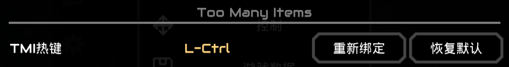

# Too Many Items 物品管理器（TMI）

[Click here for English version](./README_en.md)

---

本mod旨在提供一个便捷的界面，以供快速查询物品的生产与制造信息，在您安装了很多mod的情况下会非常有用。

就像上面所展示的那样，您可以简单的从列表中选择和查询您想要了解的项目制造信息，这包括某一项目的用途，获取方式或者某个方块的建筑成本和工厂可用于的加工过程等。

- 在您安装该mod之后，您的游戏页面会新增一个可以拖动的按钮（原始状态下会显示在左下角），单击此按钮即可直接打开TMI物品管理器页面。  
- 此外，在核心数据库内也会新增一个`TMI物品管理器`按钮，该按钮同样可以打开该页面。
- 在物品的详细信息中，如果物品具有配方属性，那么将会在详细信息页添加一个按钮直接跳转到该物品的配方页面。

而所有的按钮均如下：

通常来说，这个mod支持所有的基于json的mod和大部分没有过多自定义生产类型的第三方mod，如果第三方mod有非基于vanilla的加工或者制造流程，那么其可能需要作者做一些适配，请参阅[本项目Wiki](https://github.com/EB-wilson/TooManyItems/wiki)。

---

### 关于热键和触屏操作

如上所示的那个页面，左右两侧的每一个物件都可以通过单击打开其获取方式。若要查看其用途，在键鼠操作模式下，TMI有一个新增的热键绑定在键位设置中：

在按住此热键时单击项目即查询项目的用途。

若您使用的是触屏设备，则通过快速双击项目以查询其用途。无论是触控还是键鼠，您都可以长按条目一秒以打开项目的详细信息（如果有的话），长按一秒的进度也会以动画的形式呈现。
