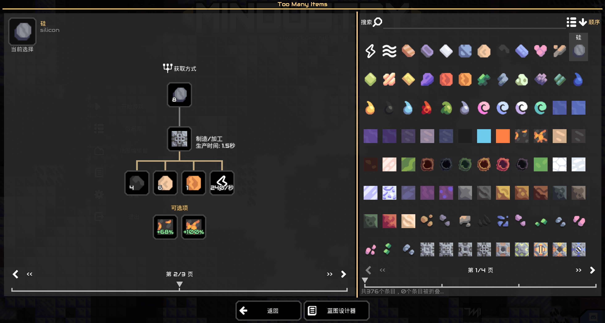

# Too Many Items 物品管理器（TMI）

---

本mod旨在提供一个便捷的界面，以供快速查询物品的生产与制造信息，在您安装了很多mod的情况下会非常有用。



就像上面所展示的那样，您可以简单的从列表中选择和查询您想要了解的项目制造信息，这包括某一项目的用途，获取方式或者某个方块的建筑成本和工厂可用于的加工过程等。

- 在您安装该mod之后，您的游戏页面会新增一个可以拖动的按钮（原始状态下会显示在左下角），单击此按钮即可直接打开TMI物品管理器页面。  
- 此外，在核心数据库内也会新增一个`TMI物品管理器`按钮，该按钮同样可以打开该页面。
- 在物品的详细信息中，如果物品具有配方属性，那么将会在详细信息页添加一个按钮直接跳转到该物品的配方页面。

而所有的按钮均如下：


通常来说，这个mod支持所有的基于json的mod和大部分没有过多自定义生产类型的第三方mod，如果第三方mod有非基于vanilla的加工或者制造流程，那么其可能需要作者做一些适配，请继续阅读。

---

## MOD开发者的自定义适配

> 以下是为mod开发者提供的交互和适配方法，如果您并不是开发者，该节将对您没有什么价值。

## JSON TMI API

> 该节向您解释使用json描述配方信息及数据的方式。如果您计划使用JAVA/JS API进行交互开发，请跳至下一节

> JSON API暂未完成，请静待后续版本

## Java TMI API

> 这部分将向您解释本mod的内部数据结构及自定义Java实现的指导

> JavaScript 被动加载暂未完成，请静待后续版本更新

TMI物品管理器为其他mod提供了完善的配方和解释API，您可以很轻松的将您的自定义加工流程通过一些方式转换为可被解释的`Recipe`对象，同时您也可以通过自定义的`RecipeType`来制作您需要的配方显示和布局方式。

由于Mindustry本身没有规范生产过程，在本mod内部将各种加工过程抽象为了一个个`Recipe`对象，这些对象会包含一个`RecipeType`，该类型会决定该配方在视图中的显示和渲染方式。而分析方块并获得配方对象的工作将由`RecipeParser`来完成，具体来说，这个过程内的绝大多数部分都是可自定义的，各结构之间的关系如下：


而上述关系中所指示的类型即在您自定义实现时，首先需要关注的几个类。

### 案例说明

下面将用一个案例来解释各类型的用途与自定义方法

#### 基础声明

首先，TMI为开发者提供了被动加载入口，您可以像在vanilla声明Mod主类一样，在`mod.json`当中声明其Recipe的被动加载类路径，这需要：

- 一个继承了`RecipeEntry`的子类型：
```java
package sample;

//imports

public class SampleRecipeEntry extends RecipeEntry{
  @Override
  public void init(){
    Log.info("recipe test");//配方管理器初始化阶段调用该方法，也是主函数入口
  }
  
  public void afterInit(){
    //后初始化阶段调用，在配方后处理前调用，用于最后处理配方
  }
}
```
- 然后在`mod.json`中添加上方声明的主类类路径：
```json5
{
  //...
  "recipeEntry": "sample.SampleRecipeEntry",
  //...
}
```

之后，当您在安装了TMI的情况下启动游戏，即可在日志中看到`recipe test`被打印，若您没有安装TMI，则这段程序不会被调用。  
这也是被动加载的目的，您可以安全的在这个入口的程序分支中安全的使用来自TooManyItems的类与程序接口，当用户没有安装TMI时，这个分支并不会被调用，也就不会因此抛出`ClassNotFoundException`

---

接着，从添加一个单独的配方开始（尽管实际可能并没有这个加工过程），例如，添加一个用煤炭和水，使用氧化炉产出一氧化碳的配方，我们在主类的init中写下如下程序：

```java 
public class SampleRecipeEntry extends RecipeEntry{
  @Override
  public void init(){
    //创建一个配方类型为factory的配方，factory为内部的默认实现
    Recipe recipe = new Recipe(RecipeType.factory);
    //为配方设置其执行的方块，为保证兼容性，所有条目被保存为RecipeItem并由一个单例管理器进行统一管理
    //因此，此处需要使用block对象通过管理器获得其映射的配方项目映射对象，之后的操作也是如此
    recipe.setBlock(TooManyItems.itemsManager.getItem(Blocks.oxidationChamber));
    //添加材料记录
    recipe.addMaterial(TooManyItems.itemsManager.getItem(Items.coal), 1);
    recipe.addMaterialPresec(TooManyItems.itemsManager.getItem(Liquids.water), 0.2f);
    //设置配方工作的标准时间消耗
    recipe.setTime(60);

    //添加产出物（不要思考一氧化碳从哪里冒出来的，它只是个例子）
    recipe.addProduction(TooManyItems.itemsManager.getItem(carbonMonoxide), 0.4f);

    //将配方添加到管理器
    TooManyItems.recipesManager.addRecipe(recipe);
  }
  
  //...
}
```

这样即可创建一个单独的配方，它会在TMI界面中正确的显示在视图当中。

---

#### 配方解析器

当然，一个个的添加并不是个好办法，如果任意一个配方都需要单独声明的话，这会增加过多的工作量，更好的办法是使用`RecipeParser`去解析方块，来根据声明的方块进行配方生成。

配方解析器本身是抽象的，它提供了一组方法供解释使用：

- `void init()`：初始化，在解析前执行
- `boolean exclude(RecipeParser<?> parser)`：分析器排除检查，这个方法用于排除冲突的分析器。具体来说，当一个方块在两个分析器的`isTarget`方法返回都为true时，若其中一个的该方法对另一个分析器返回为true，那么那个分析器将被这个分析器排除
- `boolean isTarget(Block)`：分析目标过滤器，当传入的方块的此方法返回为true则该block将由此分析器处理（如果没有另一个解析器排除了这个解析器的话）
- `Seq<Recipe> parse(T content)`：对一个目标进行分析并将分析配方结果以Seq表单形式返回

下面用一个内部分析器的实现来解释声明方法，该类型是用于解析vanilla钻头类型的分析器：

```java
public class DrillParser extends ConsumerParser<Drill>{
  //搜索地板的目标列表缓存，在初始化时添加以减少分析时的开销
  protected ObjectSet<Floor> itemDrops = new ObjectSet<>();

  @Override
  public void init() {
    //在初始化阶段先过滤出要搜索的矿物地板列表减少搜索量
    for (Block block : Vars.content.blocks()) {
      if (block instanceof Floor f && f.itemDrop != null && !f.wallOre) itemDrops.add(f);
    }
  }

  //确定方块为Drill类型的实例时返回true，令方块由该分析器处理
  @Override
  public boolean isTarget(Block content) {
    return content instanceof Drill;
  }

  @Override
  public Seq<Recipe> parse(Drill content) {
    //钻头的开采配方注册通常有多个产出物品，用产出物与映射其配方
    ObjectMap<Item, Recipe> res = new ObjectMap<>();

    for (Floor drop : itemDrops) {
      //检查方块的开采可用性
      if (drop instanceof OreBlock) markerTile.setOverlay(drop);
      else markerTile.setFloor(drop);

      if (!content.canMine(markerTile)) continue;

      //从缓存表获取此矿物对应的开采配方，配方的基础数据在初始化函数内被设置
      Recipe recipe = res.get(drop.itemDrop, () -> {
        Recipe r = new Recipe(RecipeType.collecting);//collection，内部的默认Type之一，表示资源收集/开采
        r.setBlock(getWrap(content));
        r.setTime(content.getDrillTime(drop.itemDrop));
        r.addProduction(getWrap(drop.itemDrop));

        //注册消耗项的配方材料项，根据钻头是否具有boost来计算和添加液体的可选消耗项
        if(content.liquidBoostIntensity != 1){
          registerCons(r, Seq.with(content.consumers).select(e -> !(e.optional && e instanceof ConsumeLiquidBase && e.booster)).toArray(Consume.class));
          if(content.findConsumer(f -> f instanceof ConsumeLiquidBase) instanceof ConsumeLiquidBase consBase) {
            registerCons(r, s -> s.setEfficiency(content.liquidBoostIntensity)//设置增益消耗的boost效率，注意，此处以处理函数的形式传递给注册器，有关此内容请参阅下一部分的详细解释
                .setOptionalCons()//标记为可选项
                //设置数量的数据格式化函数，使之显示效率增幅量
                .setFormat(f -> (f*60 > 1000? UI.formatAmount((long) (f*60)): Strings.autoFixed(f*60, 2)) + "/" + StatUnit.seconds.localized() + "\n[#98ffa9]+" + Mathf.round(content.liquidBoostIntensity*100) + "%"), consBase);
          }
        }
        else{
          registerCons(r, content.consumers);
        }
        //上面所使用的registerCons方法来自前一个抽象超类ConsumerParser，后文会解释该方法

        return r;
      });

      //因为开采物品的实际时间与标准时间有差异，此处通过计算实际消耗时间来计算消耗项的效率系数
      float realDrillTime = content.getDrillTime(drop.itemDrop);
      recipe.addMaterial(getWrap(drop), content.size*content.size)//地板消耗项以全覆盖为数量需求，这个数量会用于后续其他部分api计算实际工作效率使用
          .setEfficiency(content.drillTime / realDrillTime)//用时间计算效率系数，同上，用于计算生产工作效率
          .setAttribute();//将该消耗项设置为属性项，属性项计算效率时与普通消耗项不同，其效率计算会取最大值而非全部相乘
    }

    //将配方表返回为结果
    return res.values().toSeq();
  }
}
```

上文所示的分析器，其继承自类`ConsumerParser`，该类型中声明了一系列对`Consume`的解析方法，也可自行注册分析消耗项的方式，用一个内部实现为例：

```java
//该注册的第一个参数函数用于检查消耗项是否为这个分析器的分析目标
ConsumerParser.registerVanillaConsParser(c -> c instanceof ConsumeItemFilter, (recipe, consume, handle) -> {
  //分析函数内传入待处理的配方对象和消耗项，至于第三个参数即由前文的注册方法传入的处理函数，在分析器工作并生成材料输入项时应使用处理函数对产生的材料项再进行处理
  ConsumeItemFilter cf = ((ConsumeItemFilter) consume);
  //此处即按照ConsumeItemFilter的过滤器去产生材料项
  for (Item item : content.items().select(i -> cf.filter.get(i))) {
    //使用处理函数对新产生的材料项进行处理
    handle.get(recipe.addMaterial(getWrap(item), 1)//getWrap(item)方法为封装的物品管理器映射对象获取方法
        .setOptionalCons(consume.optional)
        //设置属性分组的标记对象，属性分组的材料项在计算效率时会计算同一分组内的所有消耗项中的一个最大效率
        //而分组方式根据分组标记对象确定，对象是任意类型的，只要两个材料项的分组标记的equals方法为真时就可认为两个材料项为一个属性分组
        .setAttribute(cf)
    );
  }
});
```

---

#### 配方条目映射对象以及条目管理器

前文所提到的为了保证灵活性和可扩展性，配方项目采用`RecipeItem`映射对象表示项目数据，该对象是个抽象体，其实现应当从物品管理器中产生实例，不应该从外部创建实例，即该类的所有实例都应当在物品管理器内托管。

而物品管理器内仅通过一个方法`getItem`，使用任意对象映射一个`RecipeItem`对象，而映射的生产方式同样可以使用`registerWrapper`方法进行自定义，下文为内部注册UnlockableContent的包装函数的案例：

```java
//地一个参数为对照函数，此函数返回为真时调用第二个参数传入的函数来将输入的对象包装为映射对象
RecipeItemManager.registerWrapper(e -> e instanceof UnlockableContent, RecipeUnlockableContent::new);
```

如果输入搜索映射的对象没有任何一个包装函数与之匹配，那么将会返回一个错误映射实例。
